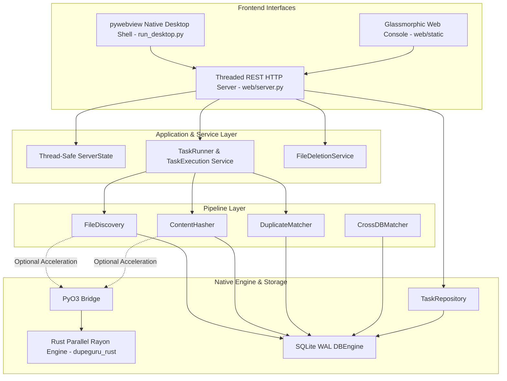

# System Architecture & Design Patterns

**de-dup** enforces a clean separation of concerns using a **Decoupled Service-Pipeline Architecture**, augmented by a native **Rust Engine** interface layer and multi-threaded background task execution.

---

## Architectural Overview

---

## Key Design Principles

1. **Decoupled Frontends**: Neither the `pywebview` native desktop shell nor the HTML Web UI directly interacts with physical disk crawling or SQLite database handles. They communicate strictly through standardized REST API endpoints and JSON contracts.
2. **Non-Blocking Background Orchestration**: The web server request threads are strictly non-blocking. File crawling, two-stage checksum calculation, duplicate matching, and large batch file deletions execute on dedicated background daemon threads managed by `TaskRunner` and `TaskExecution`.
3. **In-Memory Polling Isolation**: The web UI polls `GET /api/status` at 500ms intervals. To prevent SQLite write lock contention, active counters (`file_count`, `hashed_count`, `progress_percentage`, and status messages) are cached in memory and served directly without querying SQLite.
4. **Native Extension Layer (PyO3)**: CPU-intensive operations (recursive directory crawling, SIMD MD5 hashing) leverage the compiled Rust shared library (`dupeguru_rust.so`). If Rust is not built in the local environment, the pipeline seamlessly falls back to pure Python multi-threaded implementations (`concurrent.futures.ThreadPoolExecutor`, `xxhash`, `hashlib`).
5. **Headless & Server Compatibility**: The core application services and HTTP server operate completely independently of any X11 or Wayland GUI display server, making de-dup fully portable to Linux servers, headless containers, and NAS systems.
