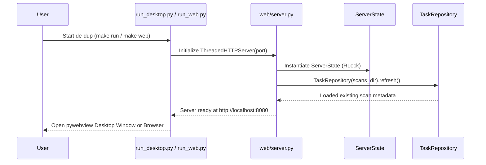
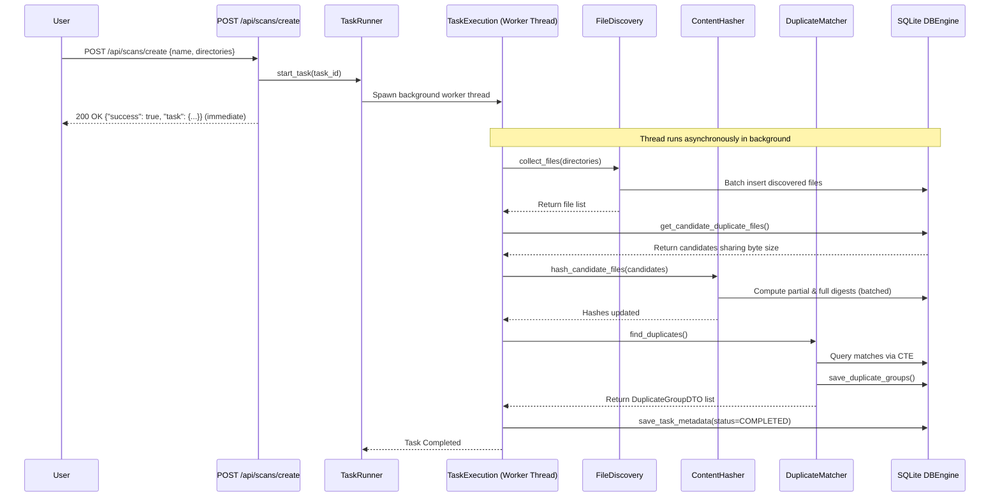
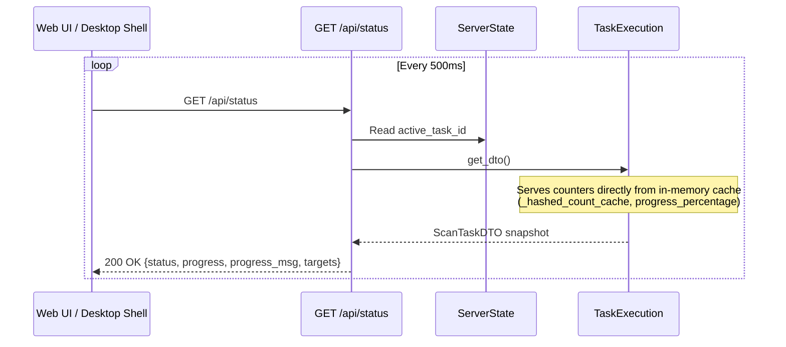

# Data Flow & Lifecycle Analysis

This document describes the runtime execution lifecycles, background thread model, and data flow pipelines within **de-dup**.

---

## 1. Application Boot Lifecycle

---

## 2. Background Scan Execution Pipeline

When a user stages directories and launches a scan via the web console or desktop shell:

---

## 3. Real-Time Status Polling Lifecycle

To prevent database lock contention during active scans, polling is completely decoupled from SQLite disk queries:

---

## 4. Duplicate Deletion Lifecycle

Deletion operations safely handle single files or large batch operations without blocking the web server:

1. **Request Reception**: `POST /api/results/delete` accepts explicit file paths or `delete_all_marked: true`.
2. **Batch Thresholding**:
   - **Small Batches (<= 50 files)**: Processed synchronously on the HTTP request handler and returned immediately.
   - **Large Batches (> 50 files)**: Dispatched to a background daemon thread (`_run_deletion_pipeline`), returning `in_background: true`.
3. **Execution**: `FileDeletionService` removes files from disk, handles read-only/permission locks, updates progress in `ServerState`, and purges records from associated `DBEngine` instances.
